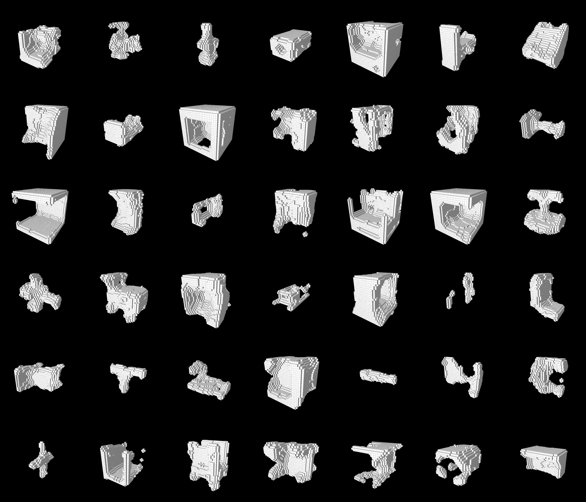
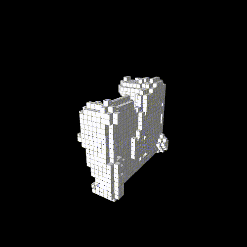
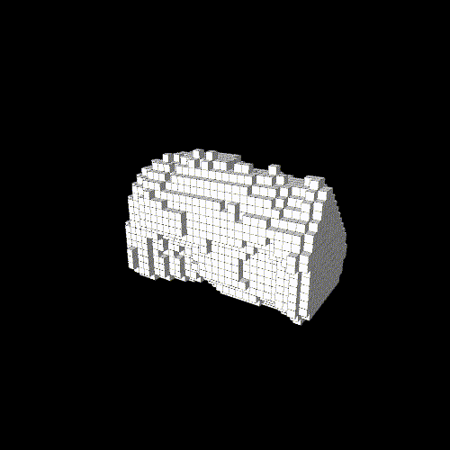
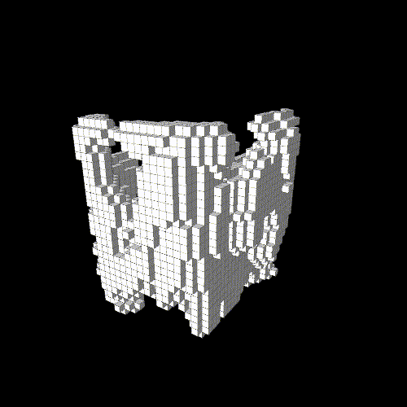

# VoxelDCGAN

Implementation of a 3D shape generative model based on <a href="https://arxiv.org/abs/1511.06434">deep convolutional generative adversarial nets</a> (DCGAN) with techniques of <a href="https://github.com/openai/improved-gan">improved-gan</a>.

Experimental results on <a href="http://shapenet.cs.stanford.edu/">ShapeNetCore</a> dataset are shown below. For training the networks, I used all 3D models in ShapeNetCore.

### Random sampling



### Linear interpolation






### Real-time generation


This is an application for visualizing linear interpolation and saving generated data as binvox. You can run this application with the following command:
```
$ python application.py
```

I strongly recommend running the app on GPU because it is very slow on CPU.

## Dependencies

To train the networks, you need to install three python packages.

* [binvox-rw-py](https://github.com/dimatura/binvox-rw-py)
* [numpy](https://github.com/numpy/numpy)
* [TensorFlow](https://github.com/tensorflow/tensorflow)

The following python packages are required for running the application. If you are using [anaconda](https://www.continuum.io/), you can easily install VTK5 and PyQt4 (or they may already be installed). I show installation commands with conda for VTK5 and PyQt4.

* [VTK5](http://www.vtk.org/)
```
$ conda install -c anaconda vtk=5.10.1
```
* [PyQt4](https://www.riverbankcomputing.com/software/pyqt/intro)
```
$ conda install -c anaconda pyqt=4.11.4
```
* [QDarkStyleSheet](https://github.com/ColinDuquesnoy/QDarkStyleSheet)
```
$ pip install qdarkstyle
```
